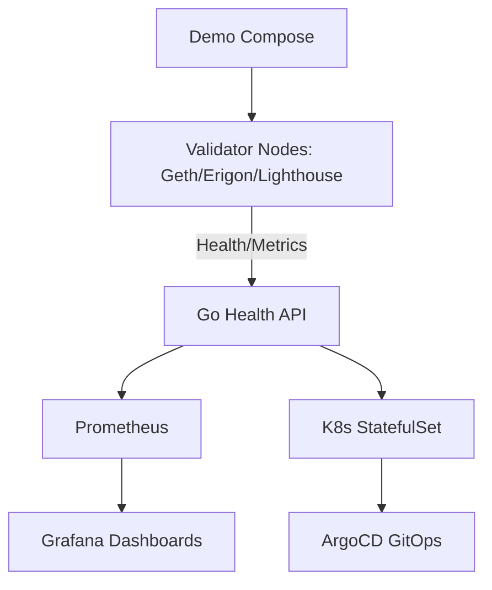

# platform-validator-ops

🚧 Status: In Progress

This repository is currently under active development.
It represents a reference implementation and learning project.
Features and architecture may change before stable release.


## Features

- Go health API for Ethereum validators (Geth/Erigon/Lighthouse): /health and /metrics with block_height, peers, sync_status
- Docker demo stack including Prometheus + Grafana
- Kubernetes StatefulSet + Service manifests for persistent validator nodes
- Real architecture diagrams (mmd) and runbooks
- CI with build/test/docker

## Architecture



### Component Breakdown

- **Ingress**: Port exposure via docker-compose or k8s Service (no external ingress in demo)
- **Service**: validator-service.yaml + k8s Service for internal discovery and metrics scrape
- **Storage**: StatefulSet volume claims for chain data; persistent in prod with Longhorn
- **Monitoring**: /metrics Prometheus text format; Grafana dashboards; alert flows in diagrams
- **Deployment flow**: `docker build` + `docker compose up`; `kubectl apply -f k8s/` or ArgoCD for GitOps

## Quick Start

```bash
git clone https://github.com/blockmalhotra/platform-validator-ops
cd platform-validator-ops
docker compose up --build
curl http://localhost:8080/health
# metrics: curl http://localhost:8080/metrics
```

See demo/docker-compose.yml for full stack.

## Roadmap

### v0.1
- Initial release

### v0.2
- Feature expansion

### v0.3
- Production hardening

### v1.0
- Stable release

## Contributing

See CONTRIBUTING.md. Professional commits, real code only.

## License

MIT License - see LICENSE file.

## Production Architecture

- Deploy on k8s with StatefulSets for validators.
- Use Vault for keys, Longhorn for storage.
- ArgoCD for GitOps.
- Multi-region HA.

## Monitoring

- /metrics: Prometheus format (block height, peers).
- Grafana: validator uptime, sync lag, alerts for offline.
- Runbook: docs/runbook.md

## Security

- mTLS for API, no keys in containers.
- RBAC in k8s.
- See docs/security.md

## CI/CD

.github/workflows/ci.yml: build, test, docker, k8s lint.

## Roadmap

- Full Lighthouse validator integration
- Helm charts
- Vault secrets
- Chaos testing

## Runbooks

See docs/runbook.md for ops, scaling, DR.

## Troubleshooting

See docs/troubleshooting.md

## Screenshots

See screenshots/ (architecture.png, validator-fleet-overview.png, dashboard.png, alert-flow.png)

## Architecture Diagrams

See diagrams/architecture.mmd

## Problem
Operating Ethereum validators at scale requires reliable health monitoring, HA deployment, observability to avoid slashing.

## Components
- Go health API (block/peers/sync)
- Docker + k8s StatefulSet
- Prometheus/Grafana
- CI/CD

## Monitoring
/metrics Prometheus, Grafana, alerts.

## Security
mTLS, RBAC, Vault in prod. CHANGEME in secrets.

## CI/CD
.github/workflows/ci.yml with build/test/docker.

## Troubleshooting
See docs/troubleshooting.md
