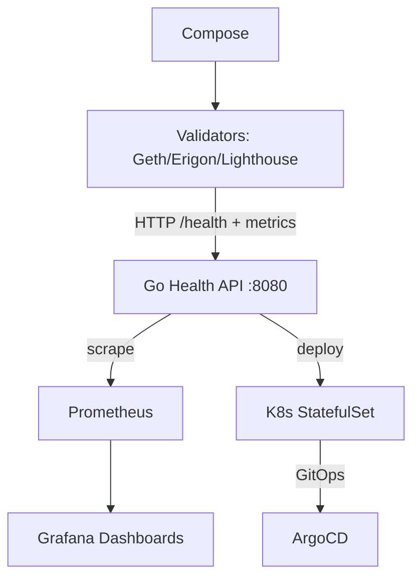

# platform-validator-ops

<p align="center">

**Production-inspired Ethereum Validator Operations Platform demonstrating Kubernetes, Observability, High Availability, Secret Management and Blockchain Infrastructure patterns.**

</p>


## Professional Summary

Lightweight Go health sidecar + Kubernetes StatefulSet reference for Ethereum validators (Geth/Erigon/Lighthouse). Exposes /health and Prometheus metrics. Includes demo Compose with Prometheus/Grafana, full k8s manifests (StatefulSet, Service, ConfigMap, Secret with CHANGEME), architecture diagrams, runbooks, and CI. Demonstrates production patterns for node health, persistent storage, and observability without embedding monitoring in the client.

## Table of Contents

- [Problem Statement](#problem-statement)
- [Why This Exists](#why-this-exists)
- [Solution Overview](#solution-overview)
- [Key Features](#key-features)
- [Architecture](#architecture)
- [Technology Stack](#technology-stack)
- [Repository Structure](#repository-structure)
- [Deployment Workflow](#deployment-workflow)
- [Monitoring & Observability](#monitoring--observability)
- [Security Considerations](#security-considerations)
- [Operational Lessons Learned](#operational-lessons-learned)
- [Screenshots](#screenshots)
- [Roadmap](#roadmap)
- [Business Impact](#business-impact)
- [Resume Relevance](#resume-relevance)
- [License](#license)

## Problem Statement

Operating Ethereum validator clients at scale introduces slashing risk from downtime, desync, or missed attestations. Manual health checks and ad-hoc monitoring fail at fleet level. Persistent chain state must survive restarts. Production needs GitOps, secrets hygiene, and unified observability decoupled from the client binary.

## Why This Exists

Validators on mainnet/holesky/sepolia require always-on signals for uptime and sync status. Existing clients do not expose standardized, scrape-friendly health endpoints out of the box. This provides a thin, deployable reference for reliable staking infrastructure on Kubernetes.

## Solution Overview

Go HTTP API returns JSON status (ok, chain, timestamp, block_height) and Prometheus text metrics. Docker Compose wires local Prometheus + Grafana. Kubernetes StatefulSet + Service + supporting manifests deliver ordered, persistent validator pods with volume for chain data. Diagrams, runbooks, and CI complete the reference implementation.

## Key Features

- Go health API: /health returns status, chain, timestamp, block_height
- /metrics Prometheus text format for scraping
- Docker Compose demo: validator-health + Prometheus + Grafana
- Kubernetes StatefulSet for Geth (light sync, HTTP) + health sidecar, with volumeClaim for chain data
- k8s Service, ConfigMap, Secret (CHANGEME values), validator-* manifests
- Mermaid architecture diagrams and operational runbooks
- CI: Go build/test + Docker validation

## Architecture



### Component Breakdown

- **Ingress**: Compose ports (8080 health, 9090 prom, 3000 grafana) or k8s Service
- **Service**: validator Service + validator-service.yaml for discovery and scrape
- **Storage**: StatefulSet volumeClaimTemplates for chain data; Longhorn in full platform
- **Monitoring**: /health + Prometheus text; Grafana for uptime, sync lag, alerts
- **Deployment flow**: `docker compose up --build`; `kubectl apply -f k8s/` or ArgoCD

## Key Engineering Decisions

- StatefulSet chosen for Geth to ensure persistent volumes and ordered startup (k8s/statefulset.yaml shows geth container with volumeClaim and health sidecar).
- Dedicated Go health sidecar container added to StatefulSet to expose standardized /health and /metrics without modifying upstream client binaries (app/main.go and k8s/statefulset.yaml).
- ConfigMap and volume mounts used for prometheus.yml to keep scrape targets versioned with code (demo/prometheus.yml).

## Production Considerations

- Secrets in k8s/secret.yml contain only CHANGEME; must be overridden from Vault or external store before production apply.
- Run with pod anti-affinity and resource limits for HA validator fleets.
- Enable alerts on block_height lag using patterns in docs/runbook.md.

## Technology Stack

- **Language**: Go (health API)
- **Containers**: Docker, Compose, Makefile
- **Orchestration**: Kubernetes (StatefulSet, Service, ConfigMap, Secret)
- **Observability**: Prometheus, Grafana
- **GitOps**: ArgoCD patterns
- **Storage/Secrets**: Persistent volumes, CHANGEME values only

## Repository Structure

```
platform-validator-ops/
├── app/main.go                 # health API (status/chain/timestamp/block_height)
├── docker-compose.yml          # demo (validator-health + prom + grafana)
├── demo/                       # prometheus.yml
├── docker/Dockerfile
├── k8s/                        # statefulset, service, configmap, secret (CHANGEME), validator-*
├── diagrams/                   # architecture.mmd, alert-flow.mmd, dashboard.mmd, validator-fleet-overview.mmd
├── screenshots/                # architecture.png, dashboard.png, alert-flow.png, validator-fleet-overview.png
├── docs/                       # runbook.md, security.md, troubleshooting.md, production-deployment.md
├── scripts/                    # build.sh, health-check.sh
├── Makefile
├── .github/workflows/ci.yml    # validate, build, docker
└── ROADMAP.md
```

## Deployment Workflow

```bash
git clone https://github.com/blockmalhotra/platform-validator-ops
cd platform-validator-ops
docker compose up --build
curl http://localhost:8080/health
curl http://localhost:8080/metrics
# Kubernetes
kubectl apply -f k8s/
# or ArgoCD sync per docs/production-deployment.md
```

## Monitoring & Observability

- /health: {"status":"ok","chain":"...","timestamp":"...","block_height":N}
- /metrics: Prometheus text
- Grafana dashboards for validator uptime, sync lag, offline alerts
- Runbook: docs/runbook.md

## Security Considerations

- Secrets use CHANGEME values only (k8s/secret.yml)
- No validator keys or mnemonics in images or defaults
- mTLS and k8s RBAC referenced in docs/security.md
- Production requires explicit secret injection (Vault patterns)

## Operational Lessons Learned

- StatefulSet + volumeClaimTemplates required for blockchain clients; ephemeral pods lose chain state.
- Dedicated health API keeps monitoring lightweight and client-agnostic.
- Compose + k8s parity enables fast local validation before cluster apply.
- CHANGEME values in secrets enforce explicit production handling and prevent leaks.

## Screenshots

### Architecture & Fleet


### Dashboards & Alerts


## Roadmap

### Completed

- Go health API with JSON status and Prometheus endpoint
- Docker Compose demo with Prometheus + Grafana
- Kubernetes StatefulSet + Service + supporting manifests for persistent validators
- Architecture diagrams (Mermaid) and initial CI
- v0.1.0-in-progress tag and portfolio standardization

### In Progress

- Recruiter-optimized documentation and cross-portfolio consistency
- Reference runbooks and security patterns

### Planned

- Helm charts
- Full multi-client + HA support
- Vault integration and chaos testing
- Production hardening

## Business Impact

Reduces slashing risk through always-on health signals and persistent storage patterns. Standardizes observability and deployment for validator fleets. Enables faster incident response via unified metrics and runbooks. Provides repeatable Kubernetes reference for staking infrastructure.

## Resume Relevance

This repository demonstrates practical experience with:

- Kubernetes Operations (StatefulSet, Service, volume claims, GitOps)
- Blockchain Infrastructure (Ethereum validators: Geth/Erigon/Lighthouse)
- Monitoring and Alerting (Prometheus text, Grafana, health endpoints)
- Secret Management (CHANGEME hygiene, RBAC patterns)
- High Availability Design (persistent pods, ordered deployment)
- Production Troubleshooting (runbooks, metrics for uptime/sync)
- DevOps Tooling (Docker, Compose, Makefile, CI)

## License

MIT License. See [LICENSE](LICENSE).

---

Reference implementation. Evidence from repository code and manifests only.
