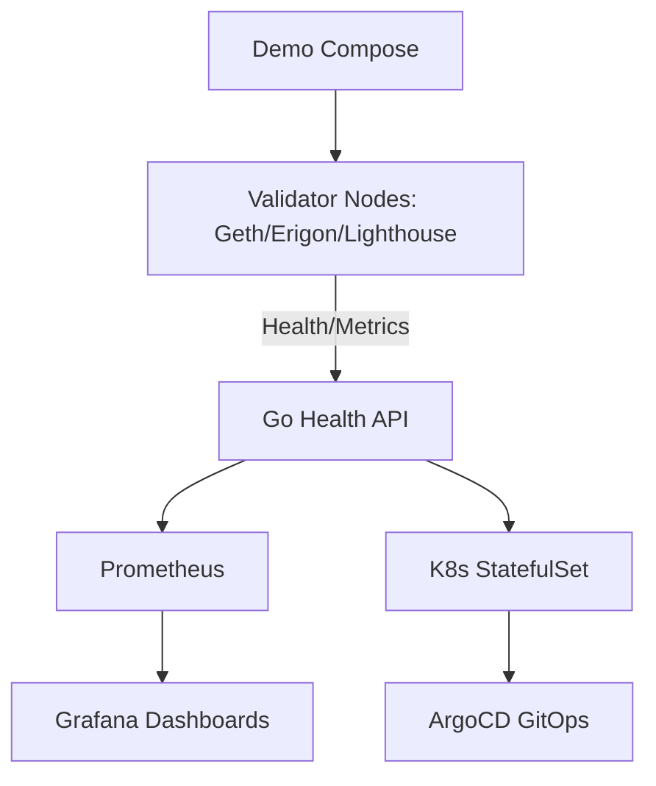

# platform-validator-ops

Production Ethereum Validator Operations Platform.


## Problem

Operating Ethereum validators (Geth/Erigon + Lighthouse) at scale requires reliable health monitoring, HA deployment, and observability to avoid slashing and downtime. Manual ops lead to errors in mainnet/holesky/sepolia.

## Architecture



## Components

- Go health API (real-time block/peers/sync for validators)
- Docker + k8s (StatefulSets for persistent chain data)
- Prometheus/Grafana for monitoring
- CI/CD (GitHub Actions)
- Demo stack

## Quick Start

```bash
git clone https://github.com/blockmalhotra/platform-validator-ops
cd platform-validator-ops
make build
make run
curl http://localhost:8080/health
```

## Demo

```bash
docker compose up --build
# Open http://localhost:3000 for Grafana (if extended)
```

See demo/docker-compose.yml

## Production Architecture

- Deploy on k8s with StatefulSets for validators.
- Use Vault for keys, Longhorn for storage.
- ArgoCD for GitOps.
- Multi-region HA.

## Monitoring

- /metrics: Prometheus format (block height, peers).
- Grafana: validator uptime, sync lag, alerts for offline.
- Runbook: docs/runbook.md

## Security

- mTLS for API, no keys in containers.
- RBAC in k8s.
- See docs/security.md

## CI/CD

.github/workflows/ci.yml: build, test, docker, k8s lint.

## Roadmap

- Full Lighthouse validator integration
- Helm charts
- Vault secrets
- Chaos testing

## Runbooks

See docs/runbook.md for ops, scaling, DR.

## Troubleshooting

See docs/troubleshooting.md

## Screenshots

See screenshots/ (architecture.png, validator-fleet-overview.png, dashboard.png, alert-flow.png)

## Architecture Diagrams

See diagrams/architecture.mmd
