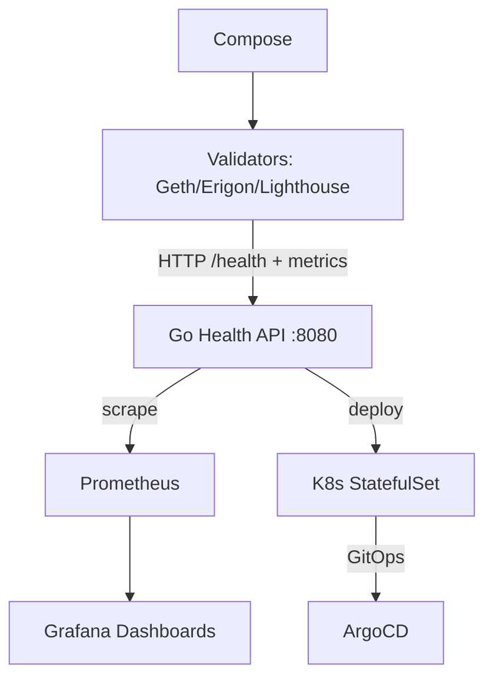
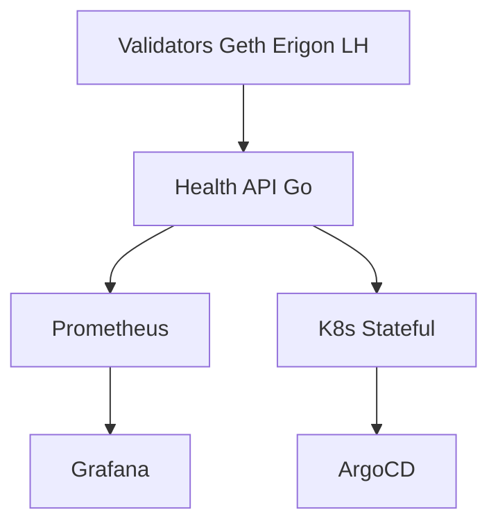

# platform-validator-ops

Production-ready Ethereum validator operations platform focused on health monitoring, metrics exposure, deployment automation, and Kubernetes-native patterns for reliable staking infrastructure.


**Overview** | [Architecture](#architecture) | [Features](#features) | [Deployment](#deployment) | [Monitoring](#monitoring) | [Security](#security) | [Screenshots](#screenshots)

## Problem Statement

Operating Ethereum validator clients (Geth, Erigon, Lighthouse) at scale introduces risk of slashing from downtime, desync, or missed attestations. Manual health checks and ad-hoc monitoring fail at fleet level. Persistent chain state must survive pod restarts. Production requires GitOps, secrets management, and unified observability without embedding monitoring inside the client binary.

## Solution

A lightweight Go health API sidecar exposes standardized `/health` and Prometheus text metrics (status, chain, timestamp, block height). Docker Compose provides local demo with Prometheus + Grafana. Full Kubernetes StatefulSet + Service manifests deliver persistent volumes, ordered deployment, and stable network identity for validators. Architecture diagrams, runbooks, and CI complete the reference.

## Features

- Go HTTP health API returning JSON status, chain, timestamp, block_height on /health
- Prometheus-compatible /metrics endpoint for scraping
- Docker Compose demo stack with Prometheus + Grafana
- Kubernetes StatefulSet for geth (light sync, HTTP) with volume for chain data
- k8s Service, ConfigMap, Secret (CHANGEME values), and supporting manifests
- Architecture diagrams (Mermaid) and operational runbooks
- CI pipeline: compose validation, build, docker

## Technology Stack

- **Language/Runtime**: Go
- **Packaging**: Docker, Makefile
- **Orchestration**: Kubernetes (StatefulSet, Service)
- **Observability**: Prometheus, Grafana
- **GitOps patterns**: ArgoCD references
- **Storage/Secrets**: Persistent volumes, Secret with CHANGEME values

## Architecture



### Component Breakdown

- **Ingress**: Port exposure via compose (8080 health, 9090 prom, 3000 grafana) or k8s Service
- **Service**: validator Service + validator-service.yaml for discovery and scrape targets
- **Storage**: StatefulSet volumeClaimTemplates for chain data; Longhorn in full platform
- **Monitoring**: /health and Prometheus text; Grafana for uptime, sync lag, alerts
- **Deployment flow**: `docker compose up --build`; `kubectl apply -f k8s/` or ArgoCD sync

<details>
<summary>Show full architecture.mmd</summary>


</details>

## Repository Structure

```
platform-validator-ops/
├── app/main.go                 # health API (status, chain, block_height)
├── docker-compose.yml          # demo (validator-health + prom + grafana)
├── demo/                       # prometheus.yml
├── docker/Dockerfile
├── k8s/                        # statefulset, service, configmap, secret (CHANGEME), validator-*
├── diagrams/                   # architecture.mmd, alert-flow.mmd, dashboard.mmd, validator-fleet-overview.mmd
├── screenshots/                # architecture.png, dashboard.png, alert-flow.png, validator-fleet-overview.png
├── docs/                       # runbook.md, security.md, troubleshooting.md, production-deployment.md
├── scripts/                    # build.sh, health-check.sh
├── Makefile
├── .github/workflows/ci.yml    # validate, build, docker
└── ROADMAP.md
```

## Screenshots

### Architecture & Fleet


### Dashboards & Alerts


## Deployment

```bash
# Local demo
git clone https://github.com/blockmalhotra/platform-validator-ops
cd platform-validator-ops
docker compose up --build

# Health check
curl http://localhost:8080/health
curl http://localhost:8080/metrics

# Kubernetes
kubectl apply -f k8s/
# or follow docs/production-deployment.md and ArgoCD patterns
```

See Makefile and scripts/ for build and health-check helpers.

## Monitoring

- `/health` returns `{"status":"ok","chain":"...","timestamp":"...","block_height":N}`
- Prometheus text metrics at `/metrics`
- Grafana dashboards for validator uptime, sync lag, offline alerts
- Runbook: docs/runbook.md

## Security

- Secrets use CHANGEME values only (k8s/secret.yml)
- No validator keys or mnemonics in images or default configs
- RBAC references in docs/security.md
- mTLS and Vault patterns noted for production

## CI/CD

`.github/workflows/ci.yml`:

- validate: `docker compose config --quiet`
- build: Go build + test (Makefile)
- docker: image build

Runs on push/PR.

## Roadmap

### Completed

- Go health API with JSON status and Prometheus endpoint
- Docker Compose demo with Prometheus + Grafana
- Kubernetes StatefulSet + Service + supporting manifests for persistent validators
- Architecture diagrams (Mermaid) and initial CI pipeline
- v0.1.0-in-progress tag and portfolio standardization

### In Progress

- Recruiter-optimized documentation and consistency across portfolio
- Reference runbooks and security patterns

### Planned

- Helm charts
- Full Lighthouse + multi-client support
- Vault integration and chaos testing
- Production hardening per ROADMAP.md

## Lessons Learned

- StatefulSet with volumeClaimTemplates is mandatory for blockchain clients; ephemeral storage loses chain state and forces resync.
- Dedicated health API sidecar keeps monitoring lightweight and decouples it from the full validator binary.
- Compose + k8s manifest parity enables fast local iteration while preserving prod behavior.
- CHANGEME values in secrets force explicit production secret injection and prevent accidental commits of real keys.

## License

MIT License. See [LICENSE](LICENSE).

---

**Reference implementation and learning project. Not production deployment.**
